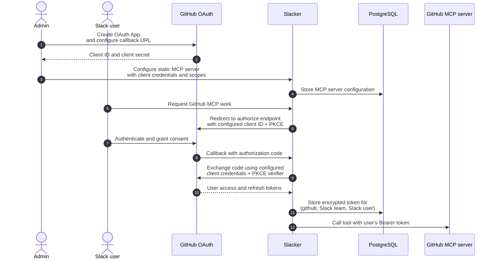
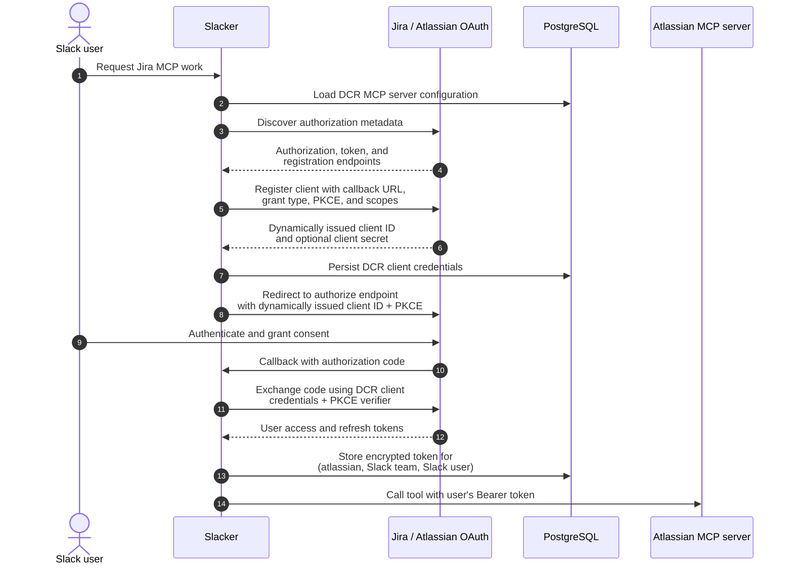

# MCP OAuth client registration

Slacker supports two ways to obtain the OAuth client identity used to connect
to an MCP server:

- **Provisioned client** (`static`): an administrator creates the OAuth client
  before configuring Slacker.
- **Dynamic Client Registration** (`dcr`): Slacker creates the OAuth client
  through the authorization server's registration endpoint.

Both approaches use the OAuth 2.0 authorization-code flow with PKCE. They
differ only in how Slacker obtains the application's client ID and secret;
each Slack user still completes consent and receives a separately stored,
delegated token.

## Provisioned client (`static`)

Use a provisioned client when an OAuth application is created and managed
outside Slacker. GitHub is the typical example: create a GitHub OAuth App,
configure its callback URL, and add its client ID, client secret, and scopes to
the Slacker MCP-server configuration.

All Slack users authorize through the same GitHub OAuth App, but Slacker stores
each resulting token under the combination of MCP server, Slack workspace, and
Slack user.

## Dynamic Client Registration (`dcr`)

Use DCR when the MCP authorization server exposes a
`registration_endpoint`. Jira/Atlassian is the primary example. On its first
connection, Slacker discovers the authorization-server metadata and registers
itself, supplying its callback URL, supported grant type, PKCE-compatible
authorization-code flow, and requested scopes.

The authorization server returns a client ID and may return a client secret.
Slacker persists those registration credentials and uses them for the
subsequent user authorization-code exchange.

## Comparison

| Concern | Provisioned client (GitHub) | DCR (Jira/Atlassian) |
| --- | --- | --- |
| Client created by | Administrator, before Slacker configuration | Slacker, at runtime |
| Initial configuration | Client ID, client secret, callback URL, scopes | Resource URL, issuer, DCR mode, client name, scopes |
| Registration endpoint | Not used | Required |
| Client identity | One pre-approved OAuth App | Created by the authorization server |
| User consent | Required for every Slack user | Required for every Slack user |
| Delegated token scope | MCP server + Slack team + Slack user | MCP server + Slack team + Slack user |

## Security considerations

- DCR creates an application client identity; it does not grant a user access
  without that user's OAuth consent.
- Slacker uses signed state and PKCE for both modes.
- Access and refresh tokens are encrypted before being saved in
  `mcp_oauth_tokens`.
- The current `client_secret_enc` storage path is not reliably encrypted for
  static or DCR client secrets despite its name; do not treat it as secure
  secret storage until this is corrected.
- Expired delegated tokens currently require reconnection because Slacker does
  not yet implement refresh-token exchange.
