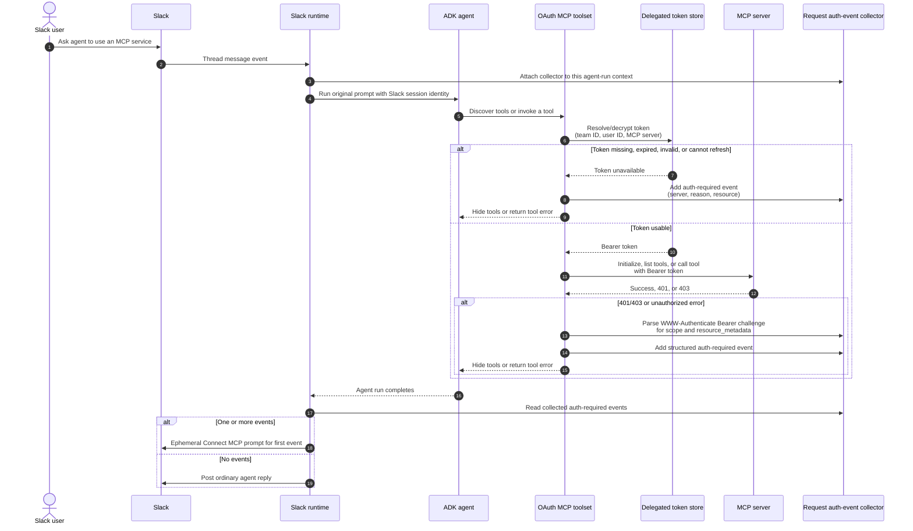

# MCP OAuth requirement detection methods

Both methods store delegated credentials per **MCP server + Slack workspace +
Slack user**, then offer the affected user an ephemeral Slack connection prompt
when access is unavailable. They differ in when and how they conclude that
OAuth is required.

## Runtime-driven resolution

This method makes the decision from concrete runtime evidence. The OAuth MCP
toolset records a structured auth-required event when it cannot resolve a valid
user token, or when the MCP server rejects a request with `401` / `403`. A
`WWW-Authenticate: Bearer` response can also provide required `scope` and
`resource_metadata` hints.



The original Slack conversation is placed in a short-lived, in-memory pending
request *before* the connect URL is exposed. The OAuth start handler requires
the URL's server, team, user, and request ID to match that record, and uses the
stored scope and metadata hints rather than browser-provided values.

```mermaid
sequenceDiagram
    autonumber
    actor User as Slack user
    participant Slack
    participant Runtime as OAuth runtime
    participant HTTP as HTTP handler
    participant Auth as OAuth authorization server
    participant KMS as Key management service
    participant Store as Delegated token store

    Runtime->>Runtime: Save pending request<br/>(server, team, user, thread, prompt, scope, metadata)
    Runtime->>Slack: Ephemeral Connect MCP button
    User->>Slack: Select Connect MCP
    Slack->>HTTP: GET /oauth/{server}/start<br/>?team_id=...&user_id=...&request_id=...
    HTTP->>Runtime: Verify server/team/user/request-ID binding
    Runtime-->>HTTP: Trusted stored auth event
    HTTP->>Auth: Discover metadata; redirect with signed state,<br/>PKCE, trusted resource and scopes
    User->>Auth: Authenticate and approve
    Auth->>HTTP: GET /oauth/{server}/callback<br/>?code=...&state=...
    HTTP->>Auth: Verify state; exchange code with PKCE verifier
    Auth-->>HTTP: User access and optional refresh tokens
    HTTP->>KMS: Encrypt tokens
    KMS-->>HTTP: Ciphertext
    HTTP->>Store: Persist token scoped to<br/>(server, team, user)
    HTTP->>Runtime: OAuth success event
    Runtime->>Runtime: Consume pending request and recheck binding
    Runtime->>Slack: Confirm and retry original prompt in its thread
```

## Slacker: predictive message classification with reactive fallbacks

Slacker first queries PostgreSQL for enabled OAuth MCP servers that lack a
token for the Slack user. Before the agent run, it classifies the user message
against those candidate servers with an LLM, falling back to server-name and
URL-host matching if classification fails. This preflight predicts need but
does not block the agent run.

```mermaid
sequenceDiagram
    autonumber
    actor User as Slack user
    participant Slack
    participant Runtime as Slacker Slack runtime
    participant DB as PostgreSQL
    participant Classifier as MCP-access classifier
    participant Agent as ADK agent / MCP client
    participant MCP as MCP server

    User->>Slack: Ask for work that may need an MCP server
    Slack->>Runtime: Slash command, mention, or thread reply
    Runtime->>DB: List enabled MCP server configurations
    Runtime->>DB: List user's connected MCP servers<br/>(team ID, user ID)
    DB-->>Runtime: Unconnected OAuth-capable servers<br/>(issuer URL configured)
    Runtime->>Classifier: Is this prompt about one of these servers?
    Classifier-->>Runtime: Matching configured server names<br/>(or name/host-match fallback)
    Note over Runtime: Keep predicted needed servers;<br/>continue with agent run

    Runtime->>Agent: Run original prompt with Slack identity
    Agent->>DB: Resolve delegated token<br/>(server, team, user)
    DB-->>Agent: Token or no usable token
    Agent->>MCP: Initialize/call MCP, bearer token if present
    MCP-->>Agent: Result or unauthorized response
    Agent-->>Runtime: Agent result or MCP-shaped error

    alt MCP-shaped error: contains MCP + unauthorized/401/token/OAuth
        Runtime->>Runtime: Select predicted unconnected OAuth servers
    else Result says it cannot complete the request
        Runtime->>Classifier: Reclassify response against missing servers
        Classifier-->>Runtime: Server requiring access
    else No access signal
        Runtime->>Slack: Post ordinary agent reply
    end
```

When a reactive check identifies an unconnected server, Slacker creates a
resumable request per server and presents private connect buttons. Its start
URL includes the Slack IDs and request ID; the current implementation accepts
those query values before authorization state is created.

```mermaid
sequenceDiagram
    autonumber
    actor User as Slack user
    participant Slack
    participant Runtime as Slacker Slack runtime
    participant DB as PostgreSQL
    participant HTTP as Slacker HTTP server
    participant Auth as OAuth authorization server

    Runtime->>DB: Store resume request<br/>(request ID, server, team, user, thread, prompt)
    Runtime->>Slack: Ephemeral "Connect MCP access" buttons
    User->>Slack: Select a server's Connect button
    Slack->>HTTP: GET /slacker/v1/oauth/{server}/start<br/>?team_id=...&user_id=...&request_id=...
    HTTP->>HTTP: Load configured OAuth service
    HTTP->>Auth: Discover metadata; resolve static or DCR client;<br/>redirect with signed state and PKCE challenge
    User->>Auth: Authenticate and approve
    Auth->>HTTP: GET /slacker/v1/oauth/{server}/callback<br/>?code=...&state=...
    HTTP->>Auth: Validate state; exchange code with PKCE verifier
    Auth-->>HTTP: User access and optional refresh tokens
    HTTP->>DB: Encrypt/store token scoped to<br/>(server, team, user)
    HTTP->>Runtime: Resume saved request
    Runtime->>DB: Verify resume-request ownership; consume request
    Runtime->>Slack: Rerun original prompt in its thread
```

Relevant implementation: `internal/slack/mcp_access.go`,
`internal/slack/handlers.go`, `internal/mcpclient/toolsets.go`, and
`internal/httpserver/oauth.go`.

## Practical difference

| Concern | Runtime-driven resolution | Slacker |
| --- | --- | --- |
| Primary OAuth-need signal | A structured event from token resolution or a real MCP `401` / `403` | LLM classification of a message against unconnected configured OAuth servers |
| When detection happens | During tool discovery/call, consumed immediately after the run | Before the agent run, then optionally confirmed after it |
| Scope and resource hints | Captured from the MCP challenge and bound to the pending request | Start URL may accept browser-provided hints |
| Start-request binding | Start request is verified against a pending record before redirect | Resume request is verified while resuming, after token persistence |
| Resume state | In-process pending request; lost on restart | PostgreSQL resume request; OAuth/PKCE pending state remains in process |
